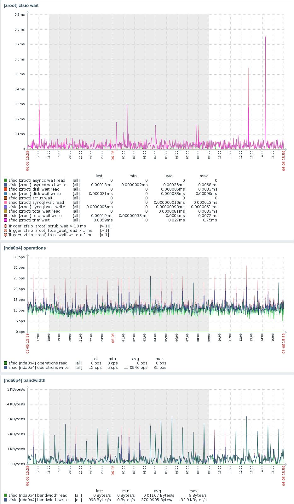
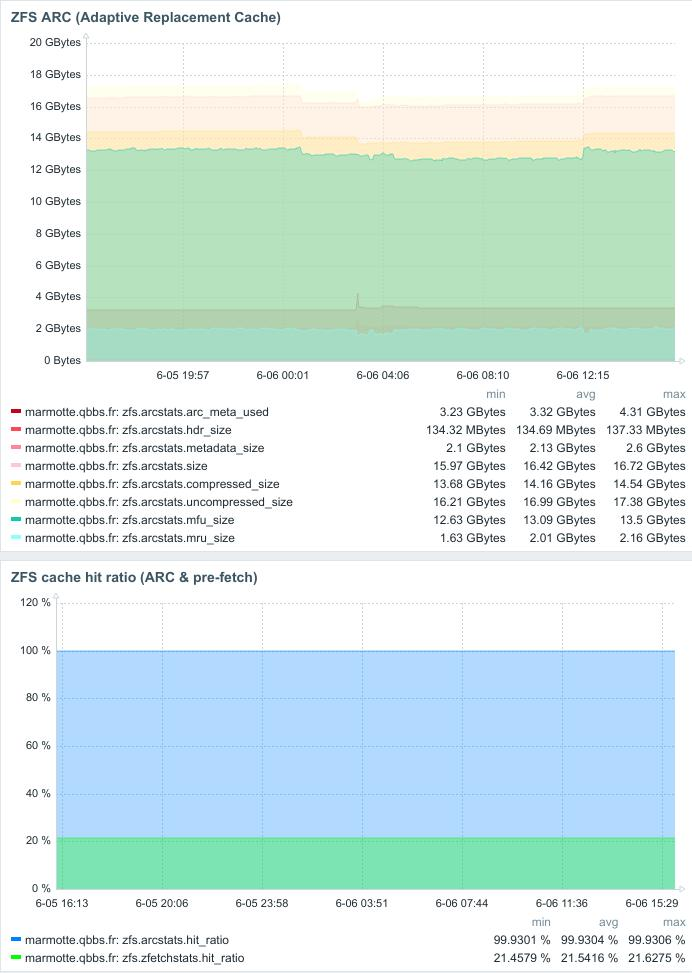

# Zabbix Template - ZFS I/O Monitoring (Zfsio)

This **Zfsio** template for **Zabbix** is used to monitor **ZFS** activity on several of my personal systems. It runs across a range of machines, from a **mini-PC** to an **Orange Pi 5+**, including an old **Dell server**, all using **ZFS** on various physical storage types: **NVMe**, **SATA**, or via a **RAID controller**.

## 🖥️ Platform: FreeBSD or Linux

### Script Installation

To set up the required helper scripts (for FreeBSD):

```shell
cp zp.pl /usr/local/bin/zp.pl
cp zpooliostat.sh /usr/local/etc/rc.d
sysrc zpooliostat_enable="YES"
/usr/local/etc/rc.d/zpooliostat.sh start
```

## 📥 Importing the Template into Zabbix

To import the template into your Zabbix instance:

1. Open the Zabbix **web front-end**
2. Go to: `Zabbix → Data collection → Templates → Import`
3. Select and import the file: `zbx_template_zfsio.yaml`

Once imported, link the template to your ZFS-enabled hosts.

## 🧩 Features

This template collects ZFS metrics using `zpool iostat` and `arcstats`, including:

* **ARC usage** - Adaptive Replacement Cache monitoring
* **ZFS pool throughput** - Transfer performance measurements
* **Read/write operations** - Detailed I/O counters
* **Cache hit ratios** - ZFS cache efficiency

Metrics are visualized in dashboards via native Zabbix widgets.

## 📊 Dashboard Examples

### ZFS I/O Performance Dashboard


This dashboard shows real-time ZFS I/O metrics including:
- Pool wait times and latency
- Operations per second (read/write)
- Bandwidth utilization
- Queue depths and performance bottlenecks

### ZFS ARC Cache Dashboard


The ARC dashboard displays:
- Adaptive Replacement Cache size and utilization
- Cache hit ratios (ARC & prefetch)
- Memory allocation breakdown
- Cache efficiency over time

## 📋 Prerequisites

* **FreeBSD** with ZFS enabled
* **Zabbix Agent** configured and operational
* Appropriate permissions to execute ZFS commands
* Template compatible with **Zabbix 6.0+**

## 🚀 Quick Setup

1. **Deploy scripts** on the target system:
   ```shell
   chmod +x /usr/local/bin/zp.pl
   chmod +x /usr/local/etc/rc.d/zpooliostat.sh
   service zpooliostat start
   ```

2. **Import template** into Zabbix via web interface

3. **Link template** to FreeBSD hosts with ZFS

4. **Verify collection** in `Monitoring → Latest data`

## 📊 Monitored Metrics

### ARC (Adaptive Replacement Cache)
- ARC cache size and limits
- Cache hit/miss ratios
- Memory usage breakdown
- Prefetch statistics

### ZFS Pools
- Read/write throughput (MB/s)
- IOPS (operations per second)
- Average operation latency
- Pool health status

### System Performance
- ZFS CPU utilization
- ZFS memory consumption
- Physical disk status
- Queue depths and wait times

## 🔧 Troubleshooting

**Metrics not collecting:**
- Check `zpooliostat` service status: `service zpooliostat status`
- Verify `zp.pl` script permissions
- Review Zabbix Agent logs: `/var/log/zabbix/zabbix_agentd.log`

**Permission errors:**
- Ensure Zabbix user can execute ZFS commands
- Check permissions on `/dev/zfs`
- Verify sudo configuration if required

## 📁 File Structure

```
zfsio-template/
├── README.md
├── zbx_template_zfsio.yaml    # ZFSio Zabbix template
├── zp.pl                      # Perl ZFS collection script
├── zpooliostat.sh             # FreeBSD service for iostat
├── zabbix_zfsio.jpg          # I/O dashboard screenshot
└── zabbix_zfsarc.jpg         # ARC dashboard screenshot
```

## 🎯 Use Cases

This template is ideal for:
- **Home lab monitoring** - Track ZFS performance on personal systems
- **Storage performance analysis** - Identify I/O bottlenecks
- **Cache optimization** - Monitor ARC efficiency for tuning
- **Multi-platform deployments** - Standardized monitoring across different hardware

## 🤝 Contributing

Contributions are welcome! Feel free to:
- Report bugs via Issues
- Suggest improvements
- Submit Pull Requests
- Share your custom configurations

## 📄 License

This project is distributed under an open source license. See the `LICENSE` file for details.

## 🔗 Useful Links

- [Official Zabbix Documentation](https://www.zabbix.com/documentation)
- [FreeBSD ZFS Handbook](https://docs.freebsd.org/en/books/handbook/zfs/)
- [Zabbix Community Templates](https://www.zabbix.com/integrations)
- [ZFS Performance Tuning Guide](https://openzfs.github.io/openzfs-docs/Performance%20and%20Tuning/index.html)

---

⭐ **Star this project if you find it useful!**
